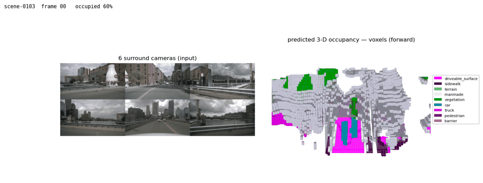

# FlashOcc — pure-PyTorch, MPS camera 3-D occupancy

A from-scratch, **pure-PyTorch / MPS-compatible** reimplementation of
**FlashOcc (BEVDetOCC, `flashocc-r50-256x704`)** — camera-only **3-D semantic
occupancy** prediction — running on Apple Silicon **without `mmcv`, `mmdet3d`, or
any custom CUDA/C++ extension**.

FlashOcc's trick is to stay **2-D**: instead of expensive 3-D convolutions on a
voxel feature, it keeps a flat BEV feature map and lets a lightweight head expand
the channel dimension into height (**channel-to-height**) to emit the full voxel
grid. This reimplementation loads the **official checkpoint directly (no key
remapping, 430 tensors, 44.74 M params)**.



*nuScenes scene-0103. **Left:** the 6 surround cameras (input). **Right:** a
VoxFormer-style **forward 3-D voxel render** of the predicted occupancy — solid,
lit cubes on the Occ3D palette (driveable surface magenta, sidewalk purple,
terrain/vegetation green, manmade grey, cars cyan, pedestrians red; free = white),
with a low camera looking down the road so it recedes to a vanishing point. The
occupancy is the full 360° grid fused from all 6 cameras; this driving view
**displays only the forward region** (≈ the front three cameras' coverage —
FRONT_LEFT / FRONT / FRONT_RIGHT). It's ego-centric — the ego stays fixed and the
world streams toward the camera as the vehicle drives, which is the motion you
see across the clip.*

---

## Architecture

```
   imgs  (B, 6, 3, 256, 704)
     │
     ├─ ResNet-50 image backbone ──────────► C4 (1024,16,44), C5 (2048,8,22)
     │
     ├─ CustomFPN neck ────────────────────► per-cam feature (B·6, 256, 16, 44)
     │
     ├─ LSSViewTransformer  (Lift-Splat-Shoot) ──────────────────────────────┐
     │     • per-pixel depth distribution over 88 bins                        │
     │     • lift each camera frustum into the shared key-ego BEV grid        │
     │     • splat + collapse_z  ──────────► BEV feature (B, 64, 200, 200)    │
     │                                                                        │
     ├─ CustomResNet BEV backbone ─────────► [128@100², 256@50², 512@25²] ◄───┘
     │
     ├─ FPN_LSS BEV neck ──────────────────► BEV feature (B, 256, 200, 200)
     │
     └─ BEVOCCHead2D  (channel-to-height) ─► occupancy logits
                                              (B, 200, 200, 16, 18)
```

**Two CNN streams + a geometric lift between them:**

1. **Image stream** — ResNet-50 → `CustomFPN` gives one 256-channel feature per
   camera at stride 16 ([`model/backbones.py`](model/backbones.py),
   [`model/necks.py`](model/necks.py)).
2. **Lift-Splat-Shoot** ([`model/view_transformer.py`](model/view_transformer.py))
   — each pixel predicts a depth distribution over 88 bins; features are lifted
   along the camera ray, transformed into the **key-ego** BEV frame (camera-0's
   ego, so the 6 differently-timed cameras share one grid), and splatted into a
   `200×200` BEV grid (z collapsed) → `(B, 64, 200, 200)`.
3. **BEV stream** — a small `CustomResNet` + `FPN_LSS` refine the top-down map to
   `(B, 256, 200, 200)`.
4. **Occupancy head** ([`model/occ_head.py`](model/occ_head.py)) — a 3×3 conv
   then an MLP that expands the channel dim into `Dz × n_cls`, reshaped to
   `(B, 200, 200, 16, 18)` — **18 classes incl. `free` (id 17)**. No 3-D convs.

The frustum→key-ego geometry mirrors the official `prepare_inputs` /
`get_ego_coor` (resize 0.44 + crop to 256×704, with the matching
`post_rot`/`post_tran` intrinsic adjustment).

---

## Evaluation

Occ3D-nuScenes GT, on nuScenes **mini**. Two metrics in
[`tools/eval.py`](tools/eval.py):

- **mIoU** (`Metric_mIoU`, camera-visible voxels, classes 0–16; `free`=17
  excluded from the average).
- **RayIoU** (`--metric ray-iou`) — a SparseOcc/Occ3D-style **surface** metric via
  a pure-PyTorch raycaster ([`tools/ray_metrics.py`](tools/ray_metrics.py)), no
  CUDA DVR renderer.

| split | mIoU | note |
|---|:--:|---|
| official `flashocc-r50` (full nuScenes val) | **32.08** | reference |
| **held-out mini-val** (162 samples) | **29.06** | apples-to-apples vs official |
| mini full-train scenes (seen) | 38.9 | train > val, the healthy pattern |

```bash
PYTORCH_ENABLE_MPS_FALLBACK=1 conda run -n simple_bev_vldrive \
  python tools/eval.py --occ-root /Users/trish/Downloads/Occ3D_nuScenes/gts --device mps
# RayIoU instead of mIoU:
  python tools/eval.py --occ-root <gts> --device mps --metric ray-iou --scene scene-0103
```

---

## Findings

### The "low" mini mIoU is a comparison artifact, not a bug
A first read of `scene-0103 mIoU 23.27` looks far below the official `32.08`, but
that's a **split / sample-size** mismatch, not a model defect:

- nuScenes-**mini**'s 10 scenes split into 6 full-**train** + 4 full-**val**
  (`0103, 0553, 0796, 0916`); the official `32.08` is a **full-val-only** number.
- On the **held-out mini-val only** the reimplementation scores **mIoU 29.06**
  (162 samples) — within small-sample variance of `32.08`.
- The per-scene spread over just 4 scenes is huge — `0103=23.27`, `0553=34.73`
  (*above* the official average), `0796=29.44`, `0916=18.6` — so the mean can't be
  pinned to better than a few points; full val (150 scenes / 6019 samples)
  averages this out.
- Train scenes score **38.9 > 29.06** val — the expected, healthy train>val gap,
  proving the loaded weights do real work.
- A/B-ruled-out the usual traps: BGR-swap normalization is correct (BGR 23.27 vs
  RGB 18.05), EMA weights load cleanly (0 missing / 0 unexpected), and the
  resize/crop/intrinsics chain is verified (driveable_surface IoU ~83 rules out
  any x/y transpose/flip). **The implementation is faithful; only more val data
  moves the number, not a code change.**

### RayIoU exposes surface-depth errors that mIoU hides
mIoU rewards any voxel overlap; **RayIoU** requires the *first surface a ray hits*
to have the right class **and depth** (`|Δdepth| < {1,2,4} m`). On scene-0103
RayIoU is `14.1` (`@1 9.5 / @2 14.1 / @4 18.6`) vs mIoU `23.27`. The gap is most
telling on the ground: `driveable_surface` mIoU ~87 but RayIoU `@1 22.5 → @4 64`
— grazing-angle ground rays are very depth-sensitive, a weakness mIoU masks.

---

## Layout

| path | role |
|------|------|
| `model/backbones.py` | torchvision ResNet-50 image backbone + `CustomResNet` BEV backbone |
| `model/necks.py` | `CustomFPN` (image) + `FPN_LSS` (BEV) feature-pyramid necks |
| `model/view_transformer.py` | `LSSViewTransformer` — Lift-Splat-Shoot frustum → BEV |
| `model/occ_head.py` | `BEVOCCHead2D` — 2-D BEV → 3-D voxel logits (channel-to-height) |
| `model/bevdet_occ.py` | `BEVDetOCC` — full model + `prepare_inputs` geometry |
| `data/loader.py` | nuScenes-mini 6-camera loader (resize/crop/intrinsics) |
| `data/occ_gt.py` | Occ3D occupancy GT (`labels.npz`) loading |
| `tools/infer.py` | single-frame occupancy inference |
| `tools/eval.py` | mIoU + RayIoU evaluation |
| `tools/ray_metrics.py` | pure-PyTorch RayIoU raycaster (no CUDA DVR) |
| `tools/visualize_occ.py` | occupancy BEV + surround-camera GIF (the demo above) |
| `tools/train_finetune.py` | short fine-tune on Occ3D GT |
| `model/checkpoints/` | `flashocc-r50-256x704.pth` (official), `finetune_flashocc.pth` (gitignored — large) |


## Run

```bash
conda activate simple_bev_vldrive
export PYTORCH_ENABLE_MPS_FALLBACK=1

# single-frame occupancy inference
python tools/infer.py --frame 0 --device mps

# evaluate (needs Occ3D GT — see data/occ_gt.py)
python tools/eval.py --occ-root /Users/trish/Downloads/Occ3D_nuScenes/gts --device mps

# occupancy visualization GIF → occ_outputs/scene-0103_occ.gif
python tools/visualize_occ.py --scene scene-0103 --max-frames 20 --device mps
```
