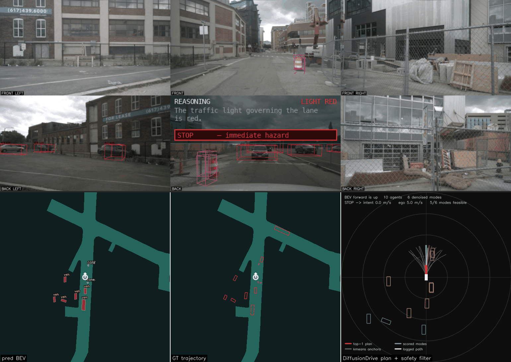

# BEVFormer-VLDrive

A pure-PyTorch, MPS-compatible re-implementation of **BEVFormer-Tiny** (ResNet-50
backbone) for nuScenes, paired with a **Qwen2.5VL-7B** vision-language planner
(served locally via Ollama). BEVFormer lifts the 6 surround-view cameras into a
bird's-eye-view feature map and decodes 3-D detections.

The VLM reads four channels — the BEV canvas, the forward camera, a
map-projected crop of the traffic light, and the decoded detections as text —
and emits a traffic-light reading, a driving decision (`PROCEED` / `SLOW_DOWN` /
`YIELD` / `STOP`) and one-sentence reasoning.

**Why those four, what each costs, and the ablations behind the design:
[RESULT.md](RESULT.md).**



*scene-0757 — a red light with a completely clear road, which a BEV-only planner
cannot get right even in principle.*

*Top: 6-camera surround view with projected 3-D boxes; VLM reasoning, `LIGHT`
chip and decision overlaid on the BACK cell. Bottom, sharing one ego-centric
forward-up frame: predicted BEV | GT trajectory | DiffusionDrive planning view
(grey anchors, teal scored modes, orange top-1 plan, white logged path).*

---

## Generating visualization outputs

All commands run from this directory (`bevformer_vldrive/`) with the conda env
active. MPS needs the CPU-fallback flag for the few ops without Metal kernels:

```bash
conda activate simple_bev_vldrive
export PYTORCH_ENABLE_MPS_FALLBACK=1
export NUSCENES_DATAROOT=/path/to/nuScenes_miniV1.0
```

`NUSCENES_DATAROOT` is optional: every tool falls back to
`~/Downloads/nuScenes_miniV1.0` then `./data/nuscenes`, and `--dataroot`
overrides both. See [tools/dataroot.py](tools/dataroot.py).

### 1. Composite scene GIFs (BEV + cameras + VLM reasoning)

```bash
# One animated composite per scene → bev_outputs/scene_gifs/scene{NN}_{name}_bev.gif
python tools/make_composite_gif.py --scenes 0 1 2 3 4 5 6 7 8 9 --vl

# A single scene:
python tools/make_composite_gif.py --scenes 5 --vl
```

Useful flags:
- `--no-vl` — skip Ollama and reuse the cached per-scene decisions in
  `tools/reasoning_decisions/decisions_scene{N}.jsonl` (fast; reruns are resumable).
- `--cam-gif` — also write a camera-only GIF per scene.
- `--frame-ms 800` — per-frame duration.

Requires Ollama running with the VLM pulled: `ollama pull qwen2.5vl:7b`.

The DiffusionDrive panel uses `assets/kmeans_plan_6.npy` (vendored, 992 bytes).
If it is missing the tool prints the regeneration command and renders two panels
instead of three. See [RESULT.md](RESULT.md#anchor-provenance) on why the
vendored anchors are for validation only.

### 2. Per-frame BEV raster + camera mosaic

```bash
# bev_outputs/bev_xxx.png (BEV detections) and bev_outputs/cameras/cams_xxx.png
python tools/infer.py \
    --dataroot "$NUSCENES_DATAROOT" \
    --checkpoint model/checkpoints/bevformer_tiny_fp16_epoch_24.pth \
    --scene 5 --max-frames 10 --score-thr 0.25 \
    --out-dir bev_outputs --save-cams
```

### 3. Pred-BEV canvas (`vis_xxx.png`) + live VLM composite

```bash
# bev_outputs/vis_xxx.png (scene canvas) and the live composite latest_bev_grid.jpg
python tools/vis_infer.py --scene 5 --max-frames 10                  # BEV only
python tools/vis_infer.py --scene 5 --max-frames 10 --vl \
    --log tools/reasoning_decisions/decisions_scene5.jsonl           # + streaming VLM
```

---

---

## Results

mini val **NDS 0.2255**, mAP **0.2334** over the 7 classes actually present
(vs the official tiny's 0.252); BEV mIoU 0.1902; 5.3 FPS on MPS. The red-light
case reads `red -> STOP` on 5/5 frames of scene-0757.

Method, ablations, retractions and caveats: **[RESULT.md](RESULT.md)**.

```bash
python tools/eval.py --score-thr 0.1      # -> eval_results/summary.json
```
