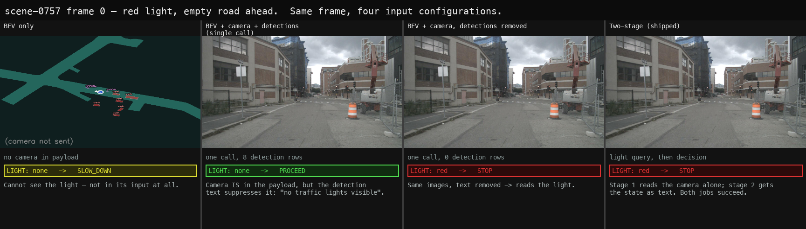

# Results — BEVFormer-Tiny + Qwen2.5-VL

Measured outcomes for the camera-only BEV perception + VLM decision stack. Every
number here was produced by a command in this repository, on an Apple M3 Max with
`qwen2.5vl:7b` served by Ollama 0.30.5, against nuScenes-mini.

**Sample sizes are stated beside every behavioural claim and they are small.**
The cost and latency figures are stable and reproducible; the behavioural ones
come from single scenes and are labelled as observations, not results. Where a
number was later retracted, the retraction is kept rather than the number.

See [README.md](README.md) for what the pipeline is and how to run it.

---

## Input design — what the VLM actually receives

The VLM receives four channels, split by what each component is actually good
at: the **rendered BEV canvas** for layout, drawn ego-centric with the heading
straight up; the **forward camera** for the semantics a BEV raster physically
cannot carry (brake lights, signage, construction, pedestrian intent, and which
signal governs this lane); a **map-projected crop** zoomed on the traffic light,
because signal state is what range destroys first; and the **decoded detections
as text** — ranges, bearings and closing rates treated as authoritative, so the
VLM is not asked to re-estimate by eye the geometry the detector already
measured.

The light is read in its **own call**, with the camera alone. A single call
carrying detection text answers "no traffic lights visible" on frames with an
obvious red; that state then enters the decision call as text. The measurement
behind that split is in [Red-light test](#red-light-test--the-case-this-change-exists-for).


Earlier the VLM saw only the rendered BEV canvas. That made the pipeline
*structurally* incapable of a correct decision at a red light with clear road
ahead — traffic lights, brake lights, turn signals, signage, construction
markings and pedestrian gaze do not exist in a BEV raster at all. It was also
being asked to estimate distances by eye from a picture of geometry the detector
had already measured exactly.

The input is now split along what each component is actually good at:

| channel | carries | authority |
|---------|---------|-----------|
| BEV canvas (ego-centric, forward-up) | scene layout | illustrative |
| CAM_FRONT wide | brake lights, signage, construction, pedestrian intent, and which signal governs *this* lane | **semantics** |
| CAM_FRONT crop (map-projected) | traffic-light state at range | **signal state** |
| detection text | range, bearing, closing rate, confidence | **metric state** |

The BEV canvas is rendered **ego-centric with the heading straight up**, not
global north-up. North-up forces the model to find the ego arrow and mentally
rotate before "ahead" means anything; forward-up removes that step and puts the
canvas in the same frame as the detection text ("12 m ahead") and the planning
view, so all three channels agree about which way is forward.

The crop is a fourth channel, not a replacement for the wide frame. The map
expansion knows where every fixture is, so rather than making the VLM hunt for a
signal head in a downscaled wide shot, the fixture is projected with the ego pose
and cropped with a `1/range` window — a light at 50 m ends up the same apparent
size as one at 15 m. The wide frame is still needed for lane context and for every
other semantic a BEV cannot carry.

Measured on scene-0757 (all red), stage-1 accuracy:

| stage-1 input | correct |
|---|---|
| wide frame only | 4/5 — misses the 32 m frame |
| wide frame + projected crop | **5/5** |

No regression on a green scene (4/4 either way), so it recovers the range-dependent
miss without inventing signals. End to end the pipeline now returns `red → STOP` on
all five frames *because it reads the light*, rather than relying on the hysteresis
latch to cover a stage-1 miss. `--no-light-crop` restores the wide-only behaviour
for A/B.

The prompt declares the detection list authoritative and tells the model not to
estimate distances from the pictures. Output gains a `LIGHT:` field
(`red | yellow | green | none`) parsed separately from the prose, because it is
the one claim that can be checked against a human label — which makes it the
first thing in this stage that can be scored at all.


## Modality-gap experiment

**Setup.** `qwen2.5vl:7b` via Ollama 0.30.5, M3 Max, scene 5 (scene-0796,
singapore-queenstown), frames 0-2, `temperature 0.1`, `num_predict 140`. Token
counts are `prompt_eval_count`; prefill/decode are Ollama's
`prompt_eval_duration` / `eval_duration`, warm (first-frame numbers include model
load and are excluded). Ablation via `--no-front-cam` / `--no-det-text`.

**Sample size is 3 frames of one scene.** Costs are stable and trustworthy;
the behavioural column is anecdotal and is reported as an observation, not a
result.

### Cost

| config | prompt tokens | prefill | decode | vl total |
|--------|---------------|---------|--------|----------|
| BEV only (old behaviour) | 1205 | ~0.35 s | ~0.45 s | **~1.0 s** |
| BEV + detection text | ~1465 | ~0.75 s | ~0.6 s | **~1.6 s** |
| BEV + CAM_FRONT ≤640 px + text | ~2600 | ~4.0 s | ~0.45 s | **~4.9 s** |
| BEV + CAM_FRONT native 1600 px + text | 3399 | — | — | — |

Decode is flat across every config; the entire cost difference is prefill, i.e.
image tokens. Splitting the timing is what made that visible — it had previously
been one opaque `vl_ms`.

### Behaviour (3 frames — anecdotal)

| config | decisions | representative reasoning |
|--------|-----------|--------------------------|
| BEV only | SLOW_DOWN, STOP | *"There are multiple vehicles ahead and no clear path"* |
| BEV + detection text | PROCEED, PROCEED, SLOW_DOWN | *"The bus is closing at 2.1 m/s and the car ahead is receding at 7.0 m/s, indicating no immediate threat"* |
| BEV + camera + text | PROCEED, PROCEED, PROCEED | *"No traffic light is visible governing the lane"* |

### Trade-offs

**The detection text is the cheap win.** It costs ~260 tokens and ~0.6 s, and it
is what moves the reasoning from vague spatial impression ("vehicles ahead and
to the right") to cited measurements ("closing at 2.1 m/s… receding at 7.0 m/s").
It also appears to defuse spurious conservatism: crowded-looking blobs on the
BEV raster read as a blocked path, while the actual ranges show otherwise. On
these frames BEV-only answered STOP where the text-equipped model answered
PROCEED and still produced a SLOW_DOWN for an approaching pedestrian — i.e.
differentiated per frame rather than uniformly cautious.

**The camera is the expensive half, and its value is currently unproven.** It
roughly doubles token count for ~3.3 s/frame — 5× the end-to-end VLM latency of
BEV-only. It is the *only* channel that can ever carry light state, so it closes
the structural gap by construction. But on every frame tested it returned
`light: none`, because scene-0796 has no signal in view, so the headline case
(red light, clear road) remains undemonstrated.

**Unwanted interaction: the camera crowds out the metric reasoning.** With the
camera attached the reasoning becomes dominated by the traffic-light question
and stops citing the measured quantities the text-only config used. That is a
prompt-attention effect, not a data-loss one — the detection text is still in the
payload — but it means adding the camera traded away some of the text's benefit.
Worth rebalancing the prompt before treating the two as purely additive.

**`--cam-width` has a floor.** 224, 384 and 640 px all produce ~2600 tokens,
because the processor rescales to its own target regardless of input size. Only
the native 1600 px frame costs more (3399). Downscaling to 640 saves ~800 tokens
against native; going below 640 saves nothing. Hence 640 as the default.

### Temporal stability

Every frame used to be an independent query, which is why the decision stream
jittered: the logged `STOP -> PROCEED -> SLOW_DOWN` inside 1.5 s on a
barely-changing scene is sampling noise, not perception, and no prompt change
fixes it. Two additions, both outside the model:

**Hysteresis** (`DecisionSmoother`). Severity latches, asymmetrically and
deliberately: escalation is immediate — the first frame that says STOP, we stop
— while de-escalation needs `release_frames` consecutive quieter frames, and a
STOP additionally holds for `stop_latch` frames because at 2 Hz a one-frame stop
is not physically actionable. A parse failure resolves to SLOW_DOWN rather than
propagating `UNKNOWN`, since the output is meant to be executed and "UNKNOWN" is
not something a controller can do.

**Previous decision in-prompt.** Stated as evidence, not as an instruction to
agree — anchoring it harder would trade jitter for an inability to react.

Measured on scene-0757, frames 0-4: baseline 4/5 correct with frame 1 flipping
to PROCEED; with both, 5/5. The stage-1 light miss still happened — the latch
caught the consequence, which is the intended division of labour.

It also paid for itself in latency. Putting the previous decision in the prompt
made the prefix stable enough for Ollama's cache to hit nearly every frame:
**prefill 7300 ms -> 20 ms, total VLM 17.4 s -> 7.4 s.** A change made for
stability turned out to be the single largest speedup in the pipeline.

### Red-light test — the case this change exists for

Candidate frames were found by projecting the map expansion's `traffic_light`
layer into CAM_FRONT using ego pose (nuScenes annotates light *locations* but
never *state*). That narrowed 404 keyframes to 172 with a light in view, then to
25 well-centred at 15-35 m. **scene-0757** — description *"Arrive at busy
intersection, bus, wait at intersection"* — has red signals with a completely
empty road ahead. Exactly the case a BEV-only planner cannot get right.



| config | LIGHT | decision | |
|--------|-------|----------|---|
| BEV only | none | SLOW_DOWN | cannot see it — not in its input |
| BEV + camera + detections, **one call** | none | PROCEED | ❌ camera present, still missed |
| BEV + camera, **detections removed** | red | STOP | ✅ same images, text removed |
| **Two-stage** (shipped) | red | STOP | ✅ |

**The single-call version failed, and not for the reason expected.** Resolution
was not the cause — native 1600 px failed identically to 640 px. Asked in
isolation the model answers correctly every time ("Yes, there is a traffic light
on the right side, and it appears to be red") at full res, at 640 px, and
cropped. So perception was never the limit.

A row sweep on the same frame isolated it:

| detection rows | prompt tokens | LIGHT |
|----------------|---------------|-------|
| 0 | 2366 | **red** ✅ |
| 1 | 2446 | none ❌ |
| 2 | 2468 | none ❌ |
| 3 / 4 / 5 | 2481 | none ❌ |

**One row is enough to break it.** Since the token counts barely move, this is
not a context-length limit — authoritative text redirects the model off the
visual task wholesale. A single call cannot do perception-from-pixels and
reasoning-over-numbers at once.

**Fix: two stages.** Stage 1 sends the camera alone and asks one question
("what colour is the light? one word"). Stage 2 gets that answer as *text*
alongside the BEV and the detections. Each call does one job.

Result on scene-0757 frames 0-2: **2/3 frames read `red` and returned STOP**
(frames 0 and 2). Frame 1 was a stage-1 miss at 32 m — a genuine perception
limit at distance, not a suppression effect — and still returned STOP via the
cones and construction vehicle.

Cost: a second call. ~10-15 s/frame end-to-end against ~4.9 s for the single
call. That is the price of the capability working at all.

### Annotating traffic-light state

nuScenes has no traffic-light *state* anywhere — the map's `traffic_light` layer
describes each fixture's full red/yellow/green bulb stack with per-lamp heights,
carries no timestamp or sample linkage, and is identical for every scene through
that city. It says a signal *exists*, never what it is *showing*. So scoring the
light-reading stage requires hand labels.

```bash
python tools/make_light_annotation.py          # -> 175 candidates across 8 scenes
open bev_outputs/light_annotation/annotate.html
# label, then Export JSONL
python tools/score_light_labels.py --labels ~/Downloads/light_labels.jsonl
```

The generator projects every map fixture into CAM_FRONT via ego pose and
calibration, keeping only frames where one lands in view, and crops around it —
**175 of 404 keyframes**, across all 8 scenes that have signals. The crop window
scales as `1/range`, so a light at 50 m is zoomed to the same apparent size as
one at 15 m; with a fixed window the far ones are unlabellable.

Frames are emitted in scene/frame order, not by range. Signals hold for
30-60 s while a scene is only 20 s, so most scenes contain at most one phase
change — you mark transitions and extend runs (`space` = same as previous)
rather than judging 175 frames independently. Realistically 20-30 decisions.

Two things that decide whether the labels are worth having:

- **"Does it govern my lane?"** is the hard call, not the colour — cross-traffic
  signals are visible at every intersection. The map's `from_road_block_token`
  is surfaced as a cue but is *weak*: it names one specific approach block while
  the ego usually sits on a neighbouring block of the same approach, so exact
  equality holds on only ~3% of frames even though both fields are fully
  populated. Judge from the image; `e` toggles.
- **`unknown` is a first-class label** and is excluded from scoring, not counted
  wrong. A frame you cannot read is not evidence about the model.

`score_light_labels.py` runs the same stage-1 query the pipeline uses and reports
accuracy by range bucket plus a confusion matrix, and calls out **RED recall**
separately — a red read as anything else is the safety-relevant failure.

Ceiling check: ~175 candidates, of which maybe 60-80 carry a genuine governing
signal, gives roughly ±10% accuracy. Enough to characterise how stage-1
degrades with range; not enough to certify a safety component.

> Gotcha found while building this: `traffic_light.pose.tx/ty` is populated
> **only on boston-seaport**. All three Singapore maps have `tx = ty = 0` for
> every fixture, which silently parks 327 lights at the map origin where they
> never project into any camera — it cost 4 of 8 scenes before it was caught.
> Use the `line_token` node centroid for position (it agrees with real pose data
> to ~3.7 m); `pose.tz` is populated everywhere and is fine for height.

### Findings worth keeping

**Multi-image works on this stack.** Verified in isolation before wiring: one
224×224 image gave `prompt_eval_count` 1070, two gave 2096, and the model
described both correctly (red/"ONE", blue/"TWO"). In the pipeline the reasoning
explicitly cites the camera, so image 2 is genuinely read rather than dropped.

**Never request a field the model has no input for.** An early version asked for
`LIGHT:` unconditionally. Run BEV-only — no camera in the payload at all — it
answered *"LIGHT: red — the light is red, indicating a stop sign even if the road
ahead appears clear"* and returned STOP. Asking for a semantic field without the
semantic channel does not produce "unknown", it produces a confident fabrication.
The field is now offered only when CAM_FRONT is attached; BEV-only uses a
contract without it.

### Not established

- The DiffusionDrive panel in the demo uses the anchor **vocabulary** only. The
  truncated-diffusion denoiser needs `feature_maps` and `agent_feature` from the
  Sparse4D image backbone, which this project does not run, so nothing here
  claims to be DiffusionDrive inference. The intent driving it is also derived
  from the coarse decision rather than queried directly — the panel labels it
  "intent from decision"; `e2e_pipeline/vlm_planner.py` does the real thing.
- The red-light case now works, but on **3 frames of one scene**, with 1 of 3
  missing the light at 32 m. Light-reading accuracy across the 172 candidate
  frames is unmeasured, and scoring it properly needs hand-labelling because
  nuScenes carries no traffic-light state annotation anywhere.
- Stage-1 reliability appears to fall off with distance (hit at 34 m and 29 m,
  miss at 32 m — so range is not the whole story either). Worth characterising
  before trusting it.
- Behavioural differences on the non-light frames rest on 3 frames of one scene.
  Decision flip rate and agreement against a human label both need a real sample
  before any of those claims are repeated as fact.

Per-frame logs record `light`, `prefill_ms`, `decode_ms`, `prompt_tokens`,
`front_cam` and `det_text` alongside the decision, so any future run is
attributable to its exact configuration.


---

## Evaluation

`tools/eval.py` evaluates BEVFormer-Tiny on nuScenes mini val (scene-0103,
scene-0916, 81 frames) from the official epoch-24 checkpoint
(`model/checkpoints/bevformer_tiny_fp16_epoch_24.pth`, 592/643 keys loaded), in a
pure-PyTorch pipeline with no `mmcv` / `mmdet3d`.

**Results (404 frames, 5.3 FPS on MPS):**

| split | NDS | mAP (10 cls) | mAP (classes present) | classes with GT |
|-------|-----|--------------|-----------------------|-----------------|
| mini val   | 0.2255 | 0.1634 | **0.2334** | 7/10 |
| mini train | 0.3148 | 0.2402 | 0.2402 | 10/10 |

BEV mIoU (all 10 scenes): 0.1902.

**Read the "classes present" column, not the raw mAP.** mini val is only
scene-0103 and scene-0916, which contain **zero** `barrier`,
`construction_vehicle` and `trailer` annotations. The devkit still scores those
three classes AP = 0 and averages them into a 10-class mean, mechanically
deflating mAP by 30% on this split. Restricted to the 7 classes that actually
occur, mAP is **0.2334 vs the official tiny's 0.252** — within small-sample
variance on 81 frames.

The same artifact inflates every TP metric, since absent classes are assigned the
worst-case error of 1.0. Over the present classes, `trans_err` is 0.870 (official
0.900) and `scale_err` 0.263 (official 0.294) — both *better* than the published
numbers. `tools/eval.py` now prints per-class GT counts, the present-class mAP,
and the TP breakdown so this cannot be misread again.

Train (0.2402) > val (0.2334) is the expected healthy pattern and confirms the
loaded weights are doing real work.

**Checkpoint coverage:** all 592 model parameters load with 0 missing and 0
unexpected. The 51 checkpoint keys left unused are `cls_branches.0-4` (per-layer
auxiliary classification heads, used only for deep supervision during training —
inference reads `cls_branches.5`) and `code_weights` (a loss-weighting vector).
Both are correctly unused at inference time.

Results are written to `eval_results/summary.json`. Re-run with:

```bash
python tools/eval.py --score-thr 0.1
```

---

## Was the decision right?

`tools/score_decisions.py` scores decisions against what the human driver
actually did, taken from the ego's own future speed profile: stopped or
decelerating hard -> STOP, easing off -> SLOW_DOWN, holding speed -> PROCEED.
Frames where the ego never moves are excluded, since they are a free STOP.

**36 scoreable decisions across 5 scenes. Agreement 16.7%.**

```
confusion (rows = human did, cols = pipeline said)
                PROCEED  SLOW_DOWN     STOP
  PROCEED             5          7        5
  SLOW_DOWN          10          0        8
  STOP                0          0        1
```

The headline number is the least useful thing here. Three readings matter more:

**The error is asymmetric, and in the safe direction.** Over-reacted on 55.6% of
frames, under-reacted on 27.8% — and **PROCEED where the human stopped: 0**.
That is the one failure that hurts, and on this sample it does not occur.

**SLOW_DOWN is never used where it is warranted.** Of 18 frames where the human
eased off, the pipeline said PROCEED 10 times and STOP 8 times, and SLOW_DOWN
zero times. The decision space is being used bimodally; the middle option is
effectively dead. That is a concrete, actionable defect no previous metric
surfaced.

**Red/yellow handling holds up.** On all 12 frames where stage 1 read red or
yellow, the pipeline slowed or stopped — 12/12.

### What this reference is not

It is the human's realised speed, a **proxy**, wrong in knowable ways: a driver
slows for reasons no sensor sees; SLOW_DOWN and PROCEED are not crisply
separable; and it rewards imitation, not safety — a human who should have braked
and did not makes PROCEED "correct". Read it as a **regression detector** ("did
this change make agreement worse?"), not as a measure of driving quality. n=36.

## Does a better detector make a better decision?

Yes -- but only if you send the BEV raster. This was measured twice, and the
first answer was wrong.

Four detectors, same 81 mini_val frames, same camera, same stage-1 light state,
same prompt, same decoding, `temperature 0.0`. Each arm's raster is rendered from
its OWN boxes by BEVFormer's `build_scene_canvas`.

| detector | mAP | agrees with GT (4-channel) | agrees with GT (3-channel) |
|---|---|---|---|
| BEVFormer-Tiny (camera) | 0.163 | 54.3% | 71.6% |
| BEVFusion robust (LC) | 0.468 | 58.0% | 69.1% |
| BEVFusion MIT det (LC) | 0.578 | **69.1%** | 72.8% |

|  | Pearson r | spread | McNemar (BEVFormer vs MIT) |
|---|---|---|---|
| 4-channel (BEV + cam + light + text) | **+0.856** | 14.8 pp | 10/22 discordant, **p = 0.050** |
| 3-channel (cam + light + text) | +0.070 | 3.7 pp | 8/9 discordant, p = 1.000 |

`tools/compare_detectors.py` (`--no-bev` reproduces the 3-channel row).

### The retraction

An earlier revision of this document concluded that **"mAP is uncorrelated with
decision agreement"** and recommended spending effort on the light/reasoning path
rather than the detector. That was measured with the BEV raster omitted, and it
does not survive putting it back. With the full payload the relationship is
monotonic in mAP and the effect is ~4x larger than the 3-channel spread.

The omission was not an oversight -- it was argued for at the time, on the
grounds that re-encoding BEVFusion boxes into BEVFormer's tensor layout risked a
silent yaw error, and that a row sweep had shown detection text dominating the
raster. Both premises were defensible. The conclusion drawn from them was still
wrong, because "text dominates raster **for reading a traffic light**" does not
generalise to "raster carries no information about **detection quality**".

### Why the raster is the channel that carries it

The detection text is capped at `max_rows=5`. It can describe five objects, so
two detectors differing mainly in the other 40+ boxes produce nearly identical
text -- the 3-channel study measured the top-5 class multiset as identical on
40.7% of frames. The raster has no such cap: every box above threshold is drawn,
so a detector that finds more of them, or places them better, changes the picture
in proportion to how much better it is. Cap the input at five rows and you cap
how much detector quality can possibly reach the decision.

The same split shows it directly. Frames where all four arms agree, with no
decisive light:

| payload | all 4 arms identical |
|---|---|
| 3-channel | 39/73 = 53.4% |
| 4-channel | 17/73 = **23.3%** |

Adding the raster more than doubles how often the arms diverge. A channel that
carried nothing could not do that.

### What did not change

**The light still dominates where it is present.** Stage 1 reads it from the
camera with no detection text in context, so it is detector-invariant by
construction, and all four arms agreed on **8/8** decisive-light frames under
both payloads.

**The noise floor is still exactly zero.** Re-running the first arm over the same
frames reproduced 81/81 decisions in both studies, so neither result is decoder
sampling.

**Agreement with the human still separates nothing.** 37.7% / 43.5% / 42.0% /
42.0% across the four arms on 69 scoreable frames -- a 5.8 pp spread against an
~8.4 pp standard error on a difference. The human reference is an imitation
proxy, and it is too coarse to rank detectors either way.

### It survives into the trajectory

`tools/compare_planning.py` carries each arm's decision through `DrivingIntent`
-> DiffusionDrive anchors and measures divergence in metres. Distance from the
ground-truth arm's trajectories orders by detector quality, same as the decisions
do:

| arm | mAP | endpoint vs GT | frames whose decision differs |
|---|---|---|---|
| BEVFormer-Tiny | 0.163 | 2.92 m | 37/81 |
| BEVFusion robust | 0.468 | 2.60 m | 34/81 |
| BEVFusion MIT det | 0.578 | **1.95 m** | **25/81** |

On the frames where two arms actually disagree the paths separate by ~5.8-6.4 m
at the horizon. So the effect is not confined to a categorical token: a better
detector puts the car measurably closer to where perfect perception would have
put it.

For comparison, the 3-channel decisions gave 1.29-1.49 m mean divergence with no
ordering by mAP -- the same flattening the decision agreement showed.

### Cost worth knowing

Sending the raster roughly triples wall-clock. In the 3-channel study the only
image was the front camera, identical across arms, so arms 2-4 hit the KV cache
almost free. Each arm now sends a different BEV image first, so every call
re-prefills: ~50 min becomes ~2 h for 81 frames x 4 arms + replica. That is the
same prompt-cache effect that took VLM latency 17.4 s -> 7.4 s earlier in this
project, running in reverse, and it is inherent to the experiment being correct.

### Limits

n = 81 frames from **2 scenes** (scene-0103, scene-0916) -- the only frames where
both BEVFusion ports have saved results -- of which 8 carry a decisive light. The
McNemar result is **p = 0.050**, which is the boundary, not a comfortable margin:
this establishes a relationship worth taking seriously, not a settled one. The
human reference rewards imitation over safety. Confirming this needs more scenes,
which needs BEVFusion inference over frames neither port has evaluated yet.

The revised actionable read: **detector quality does reach the decision, through
the raster rather than the text** -- so the top-5 text cap is itself a design
limit worth revisiting, and the earlier advice to deprioritise perception is
withdrawn.

## Anchor provenance

The DiffusionDrive planning panel draws from `assets/kmeans_plan_6.npy`, a
992-byte `(3, 6, 6, 2)` anchor vocabulary vendored into this project so a fresh
clone renders the panel without a generation step. Missing anchors, or a missing
`e2e_pipeline`, degrade to the two-panel layout with the regeneration command
printed — the panel is an extra and should not be able to take the composite
down. Verified both ways: 1540x1092 with anchors, 1026x900 without.

**These anchors are for pipeline validation, not for a training run.** They were
clustered from nuScenes-**mini**, whose 344 complete 6-step futures split into
292 straight, 30 left and 22 right. Twenty-two samples do not characterise right
turns. Upstream clustered full trainval (~28k). Regenerate with:

```bash
python ../diffusiondrive_planner/tools/gen_plan_anchors.py \
    --dataroot <nuScenes> --version v1.0-trainval \
    --out ../diffusiondrive_planner/data/kmeans --k 6 --mode per_command
```

Two conventions that bite, both recorded because neither announces itself:

- **Command order is `(right, left, straight)`** — DiffusionDrive's own, from
  `gen_plan_anchors.py`'s `CMD_RIGHT, CMD_LEFT, CMD_STRAIGHT = 0, 1, 2`. The
  SparseDrive `EgoPlanner` uses `(right, straight, left)`. Mixing them silently
  turns commanded left turns into straight-aheads.
- **The planning frame is `x` lateral, `y` forward**, transposed from this
  package's `x` forward, `y` left. Getting it wrong rotates every anchor 90
  degrees while leaving all the shapes looking entirely plausible.
