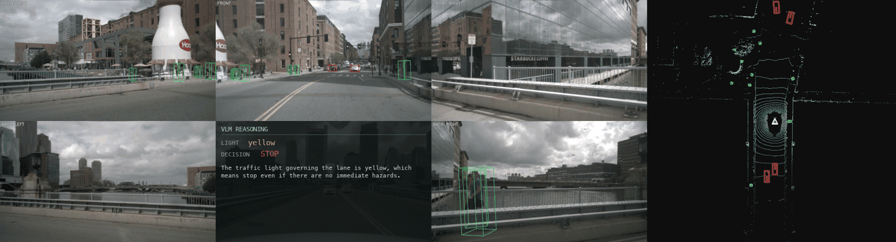

# BEVFusion-Robust — pure-PyTorch ADLab BEVFusion (PointPillars) on Apple MPS

A from-scratch, **pure-PyTorch / MPS-compatible** port of **ADLab-AutoDriving
BEVFusion** (NeurIPS 2022) — the *robustness-oriented* camera+LiDAR fusion
detector — running on Apple Silicon with **no `mmcv`, `mmdet3d`, `spconv`, or any
custom CUDA/C++ extension**. The portable **PointPillars** LiDAR path is used
(`bevf_pp_2x8_1x_nusc`); the official checkpoint loads with **0 missing / 0
unexpected** keys.

ADLab's BEVFusion keeps the camera and LiDAR streams as **independent** BEV
branches and fuses them late, so detection degrades gracefully when one sensor is
missing/corrupted — its "robust" selling point.



The BACK camera tile carries the **VLM stage**: the traffic-light state read from
the forward camera, the resulting driving decision, and the model's reasoning.
It sits on BACK because a forward driving decision depends on that view least.

The VLM receives the **same four channels BEVFormer's pipeline sends** -- BEV
raster, forward camera, map-projected traffic-light crop, and structured
detections as text -- so the only difference between the three ports is which
detector produced the boxes. The raster is drawn from **this port's own detections** --
its saved `results_nusc.json` -- so the picture differs between ports exactly as
the detection text does. What is shared is only the *renderer*: BEVFormer's
`build_scene_canvas` paints every port's boxes, so palette, scale, line width and
map layers are held fixed and the boxes are the only thing that varies. Drawing
each port with its own code would confound "which detector" with "which
renderer". See `../make_vlm_reasoning.py`.

Note what is *not* sent: BEVFusion's LiDAR point cloud. `bev_viz.bev_panel()`
renders it for the GIF, but the VLM receives boxes only. Including the points
would give the fusion arms information BEVFormer cannot have, turning "does
better detection quality help?" into "does having LiDAR help?" -- a different
question. The raster carries what each detector *concluded*, not everything it
observed.

Regenerate:

```bash
python ../make_vlm_reasoning.py --results eval_out/results_nusc.json --out viz_out/vlm_reasoning.jsonl
python visualize.py --vlm viz_out/vlm_reasoning.jsonl --device cpu   # MPS cannot voxelize int64
```


*nuScenes-mini scene. **Left:** the 6 surround cameras with the predicted 3-D
boxes projected on (cars red, pedestrians green, cones yellow, …). **Right:** the
LiDAR-frame BEV — accumulated point cloud (height-shaded) with the same boxes and
the ego at the centre, forward = up.*

---


## This port as a study arm

Both BEVFusion ports are arms in the detector-quality study in
[`../../bevformer_vldrive/RESULT.md`](../../bevformer_vldrive/RESULT.md), which
asks whether a better 3-D detector produces a better driving decision. Same 81
mini_val frames, same camera, same stage-1 light state, same prompt, same
decoding -- only the detector changes.

| arm | mAP | agrees with GT decision | trajectory endpoint vs GT |
|---|---|---|---|
| BEVFormer-Tiny (camera-only) | 0.163 | 54.3% | 2.92 m |
| BEVFusion robust (LC) | 0.468 | 58.0% | 2.60 m |
| BEVFusion MIT det (LC) | 0.578 | 69.1% | 1.95 m |

**This port sits in the middle: better than camera-only BEVFormer on both measures, behind the MIT port.** Both the decision agreement and the planned trajectory order by detection
quality (Pearson r = +0.856 on mAP vs GT-agreement).

The finding only appears with the **BEV raster** in the payload. An earlier run
that sent camera + light + detection text alone measured r = +0.07 and concluded
detector quality did not matter -- that conclusion is retracted in RESULT.md. The
detection text is capped at 5 rows, so two detectors differing mainly in the
other 40+ boxes produce near-identical text; the raster has no such cap. That is
why the GIF above sends all four channels.

Caveat carried from RESULT.md: McNemar gives **p = 0.050** exactly, on 81 frames
from 2 scenes. A relationship worth taking seriously, not a settled one.

## Architecture

```
   6 cameras ─ Swin-T ─ FPNC ─ LSS view-transform ─┐ camera BEV
                                                    ├─ concat ─ fusion convs ─ Anchor3D head ─ 3-D boxes
   LiDAR ─ PointPillars VFE ─ Scatter ─ SECOND 2D ─┘ lidar  BEV
```

- **Camera branch** ([`model/swin.py`](model/swin.py), [`model/cbnet.py`](model/cbnet.py),
  [`model/fpnc.py`](model/fpnc.py), [`model/lss.py`](model/lss.py)) — Swin backbone +
  FPN-C neck; a Lift-Splat-Shoot transform lifts image features into a BEV grid.
- **LiDAR branch** ([`model/vfe.py`](model/vfe.py), [`model/scatter.py`](model/scatter.py),
  [`model/second.py`](model/second.py)) — PointPillars: a pillar VFE, a
  parameter-free `PointPillarsScatter` to BEV, then a SECOND 2-D backbone. **No
  sparse conv** — which is exactly why this path ports cleanly to MPS.
- **Fusion + head** ([`model/bevfusion_pp.py`](model/bevfusion_pp.py),
  [`model/anchor3d_head.py`](model/anchor3d_head.py), [`model/nms_bev.py`](model/nms_bev.py))
  — the two BEV feature maps are concatenated and fused, then an anchor-based 3-D
  head regresses boxes `[x,y,z,w,l,h,yaw,vx,vy]` (BEV-NMS).

---

## Evaluation

nuScenes **mini-val**, official devkit, from `bevf_pp_2x8_1x_nusc.pth`, pure-PyTorch:

| metric | this port (mini-val) | official (full val) |
|---|:--:|:--:|
| **mAP** | **0.4675** | 0.535 |
| **NDS** | **0.4952** | 0.604 |

Per-class AP over the 7 classes actually present in mini-val averages **0.668**.
The mini gap is the 2-scene val split (3 classes absent), not a model defect — all
checkpoint keys load 0/0.

```bash
PYTORCH_ENABLE_MPS_FALLBACK=1 conda run -n simple_bev_vldrive \
  python tools/eval.py --split mini_val
```

---

## Findings

- **The shipped "TF checkpoint" is not weights.** `bevf_tf_4x8_6e_nusc.pth` is a
  zip of a single 318 MB `bevfusion_test.json` — a nuScenes *test-split detection
  submission* (predicted boxes), unusable for inference. Only
  `bevf_pp_2x8_1x_nusc.pth` is a real 584-tensor state_dict; the TransFusion path
  was deferred.
- **PointPillars needs no sparse conv.** `pts_middle_encoder` is a parameter-free
  `PointPillarsScatter` + plain SECOND 2-D convs, so the whole PP model is MPS-
  portable; the TF path (SparseEncoder / spconv) is CUDA-only.
- **MPS gap:** voxelization uses `scatter_reduce(..., reduce='amin')`, which MPS
  doesn't support for int64 — run inference/visualisation with `--device cpu`.

---

## Visualize / run

```bash
conda activate simple_bev_vldrive
export PYTORCH_ENABLE_MPS_FALLBACK=1

# single-frame inference (detection summary)
python tools/infer.py --frame 0 --device cpu

# 6-camera + LiDAR-BEV detection GIF → viz_out/bevfusion_pp_scene.gif
python visualize.py --max-frames 15 --device cpu
```

(Checkpoints live in `model/checkpoints/` and are gitignored — large.)
