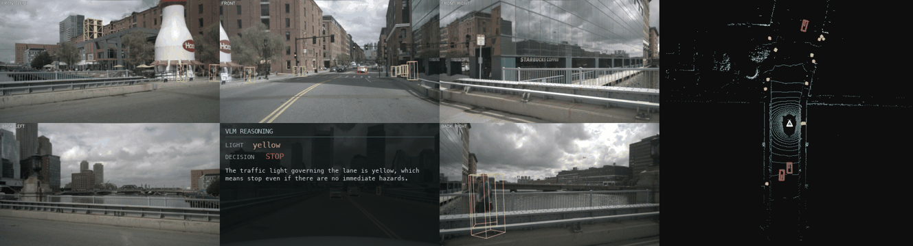

# BEVFusion (MIT) — pure-PyTorch camera+LiDAR fusion on Apple MPS

A from-scratch, **pure-PyTorch / MPS-compatible** port of **MIT-HAN-LAB
[BEVFusion](https://github.com/mit-han-lab/bevfusion)** (ICRA 2023) — unified
camera+LiDAR BEV fusion for **3-D detection *and* BEV map segmentation** — running
on Apple Silicon with **no `mmcv`, `mmdet3d`, `spconv`, `bev_pool`, or any custom
CUDA/C++ extension**. Both official checkpoints load with **0 missing / 0
unexpected** keys.



The BACK camera tile carries the **VLM stage**: the traffic-light state read from
the forward camera, the resulting driving decision, and the model's reasoning.
It sits on BACK because a forward driving decision depends on that view least.

The VLM receives the **same four channels BEVFormer's pipeline sends** -- BEV
raster, forward camera, map-projected traffic-light crop, and structured
detections as text -- so the only difference between the three ports is which
detector produced the boxes. The raster is drawn from **this port's own detections** --
its saved `results_nusc.json` -- so the picture differs between ports exactly as
the detection text does. What is shared is only the *renderer*: BEVFormer's
`build_scene_canvas` paints every port's boxes, so palette, scale, line width and
map layers are held fixed and the boxes are the only thing that varies. Drawing
each port with its own code would confound "which detector" with "which
renderer". See `../make_vlm_reasoning.py`.

Note what is *not* sent: BEVFusion's LiDAR point cloud. `bev_viz.bev_panel()`
renders it for the GIF, but the VLM receives boxes only. Including the points
would give the fusion arms information BEVFormer cannot have, turning "does
better detection quality help?" into "does having LiDAR help?" -- a different
question. The raster carries what each detector *concluded*, not everything it
observed.

Regenerate:

```bash
python ../make_vlm_reasoning.py --results eval_out_det/results_nusc.json --out viz_out/vlm_reasoning.jsonl
python visualize.py --vlm viz_out/vlm_reasoning.jsonl
```


*nuScenes-mini scene. **Left:** the 6 surround cameras with the predicted 3-D
boxes projected on (cars red, cones/barriers yellow, pedestrians green, …).
**Right:** the LiDAR-frame BEV — accumulated point cloud (height-shaded) with the
same boxes and the ego at the centre, forward = up.*

---


## This port as a study arm

Both BEVFusion ports are arms in the detector-quality study in
[`../../bevformer_vldrive/RESULT.md`](../../bevformer_vldrive/RESULT.md), which
asks whether a better 3-D detector produces a better driving decision. Same 81
mini_val frames, same camera, same stage-1 light state, same prompt, same
decoding -- only the detector changes.

| arm | mAP | agrees with GT decision | trajectory endpoint vs GT |
|---|---|---|---|
| BEVFormer-Tiny (camera-only) | 0.163 | 54.3% | 2.92 m |
| BEVFusion robust (LC) | 0.468 | 58.0% | 2.60 m |
| BEVFusion MIT det (LC) | 0.578 | 69.1% | 1.95 m |

**This port is the strongest arm: highest mAP, closest to ground truth on both measures.** Both the decision agreement and the planned trajectory order by detection
quality (Pearson r = +0.856 on mAP vs GT-agreement).

The finding only appears with the **BEV raster** in the payload. An earlier run
that sent camera + light + detection text alone measured r = +0.07 and concluded
detector quality did not matter -- that conclusion is retracted in RESULT.md. The
detection text is capped at 5 rows, so two detectors differing mainly in the
other 40+ boxes produce near-identical text; the raster has no such cap. That is
why the GIF above sends all four channels.

Caveat carried from RESULT.md: McNemar gives **p = 0.050** exactly, on 81 frames
from 2 scenes. A relationship worth taking seriously, not a settled one.

## Architecture

```
   6 cameras ─ Swin-T ─ GeneralizedLSSFPN ─ LSS depth-lift ─ BEVPool ─┐ camera BEV (80ch)
                                                                      ├─ ConvFuser ─ SECOND/FPN ─┬─ TransFusion head ─ 3-D boxes
   LiDAR ─ voxelize(mean VFE) ─ SparseEncoder (3-D sparse conv) ──────┘ lidar BEV (256ch)        └─ BEV seg head ─ map masks
```

- **Camera branch** ([`model/swin.py`](model/swin.py), [`model/lss_fpn.py`](model/lss_fpn.py),
  [`model/vtransform.py`](model/vtransform.py), [`model/bev_pool.py`](model/bev_pool.py))
  — Swin-T + `GeneralizedLSSFPN`; the LSS transform predicts a per-pixel depth
  distribution and `BEVPool`s the lifted features into an 80-channel BEV grid.
- **LiDAR branch** ([`model/voxelize.py`](model/voxelize.py),
  [`model/sparse_encoder.py`](model/sparse_encoder.py), [`model/spconv.py`](model/spconv.py),
  [`model/second.py`](model/second.py)) — the "VFE" is just a **mean over points**
  per voxel; a pure-PyTorch `SparseEncoder` (`spconv.py` reimplements `SubMConv3d`/
  `SparseConv3d`, verified vs `F.conv3d` to ~1e-5) produces a 256-channel BEV.
- **Fusion + heads** ([`model/bevfusion.py`](model/bevfusion.py),
  [`model/transfusion_head.py`](model/transfusion_head.py), [`model/seg_head.py`](model/seg_head.py))
  — a `ConvFuser` concatenates the camera/LiDAR BEVs; a shared SECOND/SECONDFPN
  backbone feeds a **TransFusion** detection head and a **BEV segmentation** head.

---

## Evaluation

nuScenes **mini-val**, official devkit, pure-PyTorch on MPS:

| task | metric | this port (mini-val) | official (full val) |
|---|---|:--:|:--:|
| Detection | mAP / NDS | **0.578 / 0.575** | 0.685 / 0.714 |
| Map seg.  | mIoU | **0.712** | 0.627 |

Detection per-class: bus .99, car .92, ped .93, cone .90, truck .81, moto .70,
bike .53 (trailer / construction_vehicle / barrier absent in mini). Seg per-class:
drivable 88.9, ped-crossing 79.9, walkway 71.6, carpark 76.4, divider 58.5,
stop-line 52.1 — matching/exceeding the official full-val per-class numbers.

```bash
PYTORCH_ENABLE_MPS_FALLBACK=1 conda run -n simple_bev_vldrive \
  python tools/eval_det.py --device cpu        # mAP / NDS
  python tools/eval_seg.py --device cpu        # mIoU
```

---

## Finding — the Swin `PatchMerging` bug

The camera branch was silently broken: a wrong `PatchMerging` ordering in the
Swin backbone corrupted the image features. Fixing it lifted **detection mAP
0.508 → 0.578** and **segmentation mIoU 0.302 → 0.712** (e.g. cone AP .51 → .90,
car .85 → .92). The lesson: a quietly-degraded camera stream hurts *both* the
detection and segmentation heads, since they share the fused BEV — and the
checkpoint still loads 0/0, so only the metrics reveal it.

---

## Visualize / run

```bash
conda activate simple_bev_vldrive
export PYTORCH_ENABLE_MPS_FALLBACK=1

# 6-camera + LiDAR-BEV detection GIF → viz_out/bevfusion_mit_scene.gif
python visualize.py --max-frames 15 --device cpu
```

(Checkpoints `model/checkpoints/bevfusion-{det,seg}.pth` are gitignored — large.)
