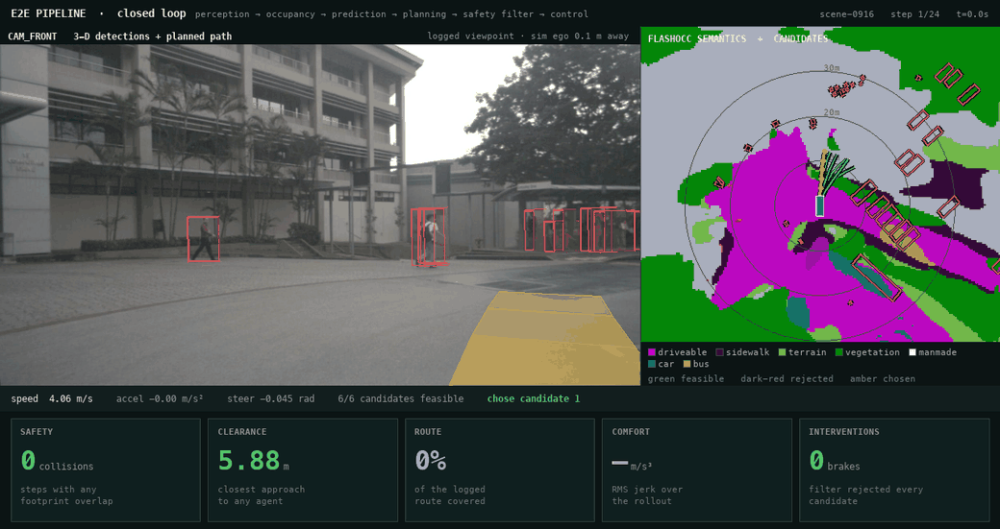

# e2e_pipeline — modular end-to-end AD stack

The integration layer between the perception ports and the planner: dense + object
perception fused into one scene representation, uncertainty measured rather than
assumed, and a safety gate that can veto the learned plan.



*scene-0916, 24 closed-loop steps. **Left:** front camera with 3-D agent boxes and
the chosen plan on the road surface. **Right:** FlashOcc's full 18-class Occ3D
output — not the drivable/obstacle reduction the planner consumes — with all six
DiffusionDrive candidates coloured by the filter's verdict. **Below:** the five
metric families, live.*

This scene is 16 of 24 steps a right turn, and the pipeline used to plan it as
`straight` because the drive command was hardcoded. Fixing that is the single
largest change in the project's history:

| scene-0916 | hardcoded `straight` | derived per step |
|---|---|---|
| collisions | **8** | **0** |
| min clearance | 0.00 m | **2.19 m** |
| route completion | 12.6% | **35.1%** |
| emergency brakes | 19/24 | **10/24** |

One thing in the picture is not literally true, and the overlay says so rather
than hiding it. The loop simulates ego motion, so the ego drifts off the logged
trajectory — and nuScenes has no camera frame from a pose the car never occupied.
The overlay projects world geometry through the **logged** camera: the projection
is exact, the viewpoint is logged, and the gap is printed in the header
(`sim ego 1.6 m away`).

## Layout

`scene.py` unified ego-frame representation (frame contract lives here) ·
`freespace.py` Occ3D volume → traversable/obstacle/unknown + ESDF + BEV semantics ·
`temporal_occlusion.py` unknown as "not observed in N frames", world-frame ·
`uncertainty.py` CV Kalman + calibrated score→covariance → collision probability ·
`safety_filter.py` four gates + three-valued unknown handling ·
`verifier.py` independent re-check between planning and control (8 rules) ·
`world_model.py` latent rollout + critic · `vlm_planner.py` Qwen2.5-VL → intent →
anchors · `calibration.py` Platt/ECE · `live_adapter.py` real detections +
association · `pipeline.py` per-frame orchestration behind Protocols ·
`closed_loop.py` runner + GT/live/FlashOcc worlds · `metrics.py` five families ·
`divergence_metrics.py` divergence-aware safety · `visualize.py` → GIF ·
`tests/` **212 tests**

## Architecture

```
                         6 x surround-view RGB
                ┌──────────────────┴──────────────────┐
                ▼                                     ▼
          Sparse4D v3                             FlashOcc
     3-D boxes + track ids              (200,200,16,18) Occ3D semantics
       (LiDAR, rotate -pi/2)          ──► freespace.py + temporal_occlusion.py
                │                         traversable / obstacle / unknown
                │                         + ESDF + BEV class map
                └──────────────────┬──────────────────┘
                                   ▼
                    scene.py — SceneRepresentation
              one ego frame: +x fwd, +y left, metres
          agents (+Kalman cov, +forecast) │ free space │ ego
                                   │
         ┌─────────────────────────┼─────────────────────────┐
         ▼                         ▼                         ▼
   uncertainty.py            vlm_planner.py            safety_filter.py
  Kalman cov (fitted      Qwen2.5-VL -> intent      1 drivable area
  score->sigma) + QCNet   + route-derived command   1b unknown, graded
  Laplace -> P(collision)          │                2 swept-footprint
        │                          ▼                3 KBM feasibility
        │        DiffusionDrive anchors (3 cmd x 6) 4 calibrated risk
        └──────────────────────────┴──────────────────►│
                                   ▼  best feasible, else emergency brake
                            verifier.py  (independent re-check, default-off)
                                   ▼
                    controller (pure pursuit) -> kinematic bicycle
                                   └──── ego state feeds back ────┘
```

Both branches run off the same cameras and converge on `SceneRepresentation`.
**Everything downstream reads only that**, which is what makes the four networks
swappable behind `Protocol`s.

- **The VLM cannot cause a collision.** It sits upstream of the safety filter, so
  it narrows a set the filter already vetted.
- **Latency stops being a defect.** Intent is slowly varying; `IntentCache` holds
  it while planner and filter run at ~40 Hz.
- **Two perception branches, neither redundant.** Sparse4D reports 10 scored
  classes above threshold; FlashOcc marks a voxel occupied without naming it.

### Frame contract

Everything is **ego frame at the current keyframe**: `+x forward, +y left, +z up`,
yaw CCW from `+x`, metres. Sparse4D is LiDAR-native and needs `−π/2`; FlashOcc is
already ego-aligned. Getting the rotation wrong is **silent** — a 90° BEV rotation
raises nothing and makes every clearance query answer about the wrong direction —
so it is pinned by `test_pipeline.py::test_lidar_forward_maps_to_ego_forward`,
which caught a sign error during development.

## Results

Canonical: 10 nuScenes-mini scenes × 20 steps, derived commands, `w_risk = 1.0`.

| config | ego-fault | other | brakes | clearance | completion | jerk | divergence | lat p50/p95 |
|---|---|---|---|---|---|---|---|---|
| GT, pinned | **0** | **0** | 41 | 1.94 m | 52.5% | 1.13 | 0.0 m | 24 / 63 ms |
| GT, free | **0** | **0** | 78 | **2.05 m** | 49.2% | **1.00** | 4.5 m | 23 / 68 ms |
| LIVE, pinned | **0** | **0** | 70 | 1.73 m | 52.5% | 1.27 | 0.0 m | 28 / 69 ms |
| LIVE, free | **0** | 20 | 94 | 1.83 m | 39.8% | 1.32 | 5.2 m | 27 / 69 ms |

"LIVE" replaces the GT oracle with real BEVFormer detections. "Pinned" holds the
ego on the logged trajectory, which removes the deviation confound described
below and is the number to read for **safety**; "free" is the number to read for
whether the policy **drives**.

### What the closed loop surfaced

- **The drive command was hardcoded to `straight`.** The planner accepted a
  command argument and ignored it. Anchors are clustered *per command*, so this
  discarded 97% of the candidate vocabulary — 0.5 m of lateral spread against
  19.9 m — and steered the ego off-route on the 20.5% of steps that turn. It
  caused **every collision in the project**. Deriving it: other-fault 7 → 0 (GT),
  brakes −26%, clearance +28%, completion +5.5 pp, divergence −32%.
- **Collision counts under a simulated ego measure deviation, not driving.** Pin
  the ego to the log and collisions fall to zero under GT *and* live perception.
  Metrics are now reported in matched divergence buckets, with recovery rate and
  a per-decision counterfactual against the human's own trajectory.
- **The covariance model was an untested assumption.** Fitting `σ(score)` against
  11,730 detector-to-annotation matches replaced `σ = k/score` with
  `σ = 0.609 + 0.466/score` (2.7× lower residual). Measuring velocity error
  separately showed it is **independent of score** — and that it governs 87% of
  propagated variance against position's 5.5%.
- **7 of 11 "this component does nothing" results were unmeasurable, not inert.**
  Six call sites silently dropped a keyword argument; one weight was swept
  entirely outside its identifiable range. Guarded now by a required-argument
  sentinel, `__post_init__` validation, and per-layer reachability tests.

### Known limit

Recovery rate is **0%** across 8 divergence excursions, under both perception
sources. The command fix made excursions 33% rarer and 32% shorter and did not
make a single one recoverable. Divergence remains a one-way boundary.

Method, ablations and 12 retracted causal claims: **[EXPERIMENT.md](EXPERIMENT.md)**
· per-change before/after: **[RESULT.md](RESULT.md)**

## Usage

```python
from e2e_pipeline import E2EPipeline, EgoState

pipe = E2EPipeline(
    detector=my_sparse4d_adapter,      # -> (boxes (N,9) lidar, track_ids, scores, labels)
    occupancy=my_flashocc_adapter,     # -> (semantics (200,200,16), mask_camera|None)
    planner=my_diffusiondrive_adapter, # -> (candidates (K,T,2) ego, scores (K,))
    forecaster=my_qcnet_adapter,       # optional; CV fallback otherwise
    occupancy_every=2,
)
out = pipe.step(images, meta, EgoState(speed=8.0), command=1)
trajectory = out.trajectory            # (T, 2) -> controller
```

The four networks are separately-trained ports sharing no backbone, ~2–3 s/frame
serially on an M3 Max, so supply live adapters or cached per-frame tensors — the
integration logic under test is identical either way.

```bash
conda run -n simple_bev_vldrive python -m pytest e2e_pipeline/tests/ -q   # 212 tests, ~2 s
python -m e2e_pipeline.visualize --scene 6                # the GIF above
python -m e2e_pipeline.final_baseline                     # the results table
```
