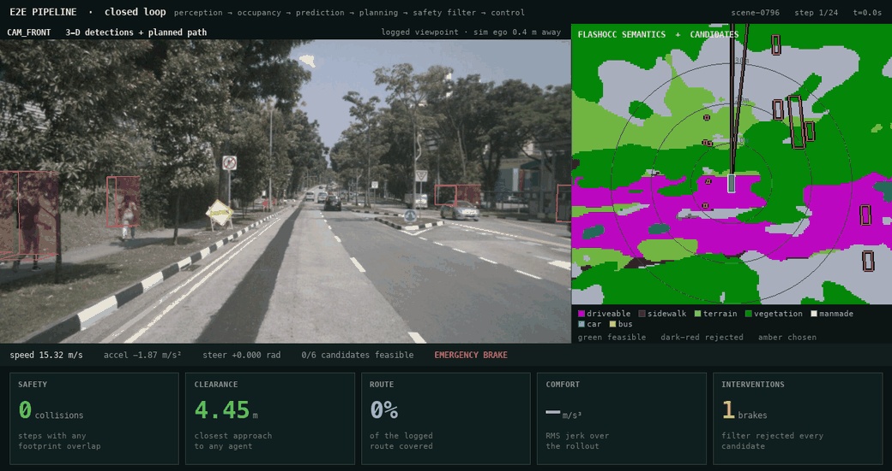

# Results — e2e_pipeline

Measured outcomes for the modular AD integration layer: occupancy-based free
space, uncertainty-aware risk, the four-gate safety filter, the VLM intent
bridge, and closed-loop evaluation against a kinematic bicycle model.

Every number was produced by a command in this repository on an Apple M3 Max.
Sample sizes are stated beside every claim. Where a number was later retracted,
the retraction is kept rather than the number.

See [README.md](README.md) for the architecture and how to run it.

---

## What this adds

### 1. Dense geometry alongside object detection

`freespace.py` reduces FlashOcc's `(200, 200, 16, 18)` logit volume — 640k voxels — to
three `(200, 200)` rasters plus a distance field. That is ~0.5% of the voxel volume
and is directly consumable by a cost function.

The reduction is not "is this column occupied anywhere":

- **Height band.** Only the slab the vehicle body sweeps counts. Gantries and bridge
  decks are occupied voxels the ego drives under; the road surface is an occupied
  voxel it drives over. Default band is z ∈ [0.2, 2.2] m, derived from the grid config
  rather than hard-coded.
- **Semantics over geometry.** This is where Occ3D's 17 classes beat a binary grid:
  geometry alone cannot separate road from curb, since both are "stuff near the
  ground". `driveable_surface` is traversable, `sidewalk`/`terrain` are neither
  drivable nor walls, and a `pedestrian` voxel is an obstacle at any height.
- **Unknown ≠ free.** Occ3D ships `mask_camera` because unobserved voxels carry no
  information. A grid reporting "free" where no camera looked invites the planner into
  occlusion shadows, which is the exact failure occupancy was meant to fix.

Why it matters: Sparse4D only reports objects in the 10 scored nuScenes classes that
clear a score threshold. Debris, a jersey barrier at an odd angle, unclassified
construction equipment — none of those can enter an object-centric plan. Occupancy
does not need a name to mark a voxel occupied.

### 2. Safety / feasibility filter

`safety_filter.py` gates DiffusionDrive's candidates on four independent axes:

| Gate | Source | Catches |
|---|---|---|
| Drivable area | FlashOcc | plans that leave the road onto empty sidewalk |
| Collision | FlashOcc | swept footprint vs occupied space, class-agnostic |
| Dynamics | KBM limits | curvature, accel, lateral load the vehicle cannot deliver |
| Risk | Sparse4D + QCNet | probabilistic collision with uncertain agents |

Gates 1–2 are class-agnostic and close the taxonomy hole; gate 4 is identity-aware.
Neither is redundant.

**Re-ranking is legitimate here, and this is easy to get wrong.** In the SparseDrive
`EgoPlanner`, `ego_fut_mode=3` and the three modes *are* the driving commands — picking
among them would override the navigation intent and turn a commanded left turn into a
straight-ahead. DiffusionDrive is different: it has `3 commands × 6 anchors = 18` plan
queries and the command *selects* which set of 6 to use. The candidates reaching this
filter are genuine alternatives under one fixed intent, so choosing among them is a
safety decision, not a routing decision.

If every candidate fails, the filter emits an explicit emergency-brake profile and
flags the frame rather than returning the least-bad plan. `CandidateVerdict` records
*all* violated gates, not just the first — when everything is rejected you need to know
whether the scene is geometrically impossible or the planner is proposing undriveable
curvature.

### 3. Uncertainty-aware prediction and risk

`uncertainty.py` carries four sources, two of which already existed and were never
read:

- **Position / velocity** — Sparse4D emits boxes and stable track ids but no
  covariance; it is a detector with an instance bank, not a filter. A constant-velocity
  Kalman filter over the association it already provides yields a real 4×4 `P` for
  free. Detection score feeds the measurement noise, so a 0.3-score box enters as a
  *vague* observation rather than a confident one.
- **Prediction spread** — QCNet's decoder already regresses a Laplace scale per mode,
  per timestep, per dim (`to_scale_refine_pos`). The checkpoint predicts it and the
  loss trains it; nothing downstream looked at it.
- **Mode probability** — an agent that might turn left or go straight is genuinely
  bimodal. Collapsing to the argmax discards exactly the branch that hits you.
- **Plan multiplicity** — DiffusionDrive's 6 anchors give a candidate set to select
  among.

Combined as `σ²_total(t) = σ²_pred(a,k,t) + σ²_track(a,t)` — one is "where will it
choose to go", the other "where is it now and how fast", and neither informs the other.
Collision probability against a deterministic ego waypoint is then the probability that
a 2D Gaussian lands inside a disc, which is a non-central chi-squared CDF — closed form,
no sampling.


## Known limits and tuning surfaces

- **Risk defaults are conservative.** `accel_noise=2.0 m²/s³` means a one-frame-old
  track carries roughly 5 m of positional uncertainty at a 3 s horizon. That is
  defensible physics for an agent of unknown intent, but it makes the risk gate fire
  readily. Calibrate against real tracks before trusting `max_risk=0.05` — the right
  way to set it is the collision-rate metric below, not intuition.
- **Disc-disc collision approximation.** `RiskModel` circumscribes both footprints with
  discs, which is conservative and cheap. The geometric gate uses the true swept
  rectangle; only the probabilistic gate approximates.
- **Rate decoupling does not ego-motion compensate.** `occupancy_every > 1` reuses the
  cached grid as-is. Under a metre of drift at N=2 and 2 Hz keyframes; if you raise N,
  warp it first with the same shift-and-rotate used for BEVFormer's `prev_bev`.
- **No live adapters ship here.** The `Protocol`s define the contract; the four
  adapters are the remaining integration work. The closed loop therefore
  runs against `GTWorldModel`, an oracle, which isolates the planning stack.

## Closed-loop evaluation

```python
from e2e_pipeline import ClosedLoopRunner, GTWorldModel, LoopConfig, format_report
runner = ClosedLoopRunner(GTWorldModel(nusc, scene_idx=0), planner, LoopConfig())
records, metrics = runner.run(command=2)
print(format_report(metrics))
```

The ego pose comes **only** from integrating the kinematic bicycle model under the
controls its own planner produced. Nothing snaps it back to the log — that is the
property open-loop replay cannot test, since open loop teleports the ego onto the
recorded path every frame and hides compounding error.

Five metric families ([metrics.py](metrics.py)), definitions pinned by tests:

| family | definition |
|---|---|
| safety | collision by **separating-axis test on oriented boxes** — two cars 2.2 m apart laterally do not touch, but circumscribed discs (r≈2.47 m) do, so a disc test inflates every number. Plus min clearance and TTC violations. |
| route | arc-length projection onto the reference polyline; furthest point reached, so stopping does not surrender ground covered. Lateral deviation reported separately. |
| comfort | longitudinal/lateral accel and jerk, RMS **and** violation counts — RMS alone hides one violent manoeuvre. Lateral accel from the realised path, not the steering command. |
| prediction | ADE/FDE against what agents actually did; agents leaving the scene are `unscoreable`, not wrong. |
| latency | per-stage p50/p95 — the tail breaks a control loop, the mean does not. |

### Results, 20 steps/scene, GT world model

All 10 mini scenes, 20 steps each, totals across scenes. Completion is averaged
over the 8 scenes with a non-degenerate route (see below).

| planner | ego seed | brakes | collisions | mean completion |
|---|---|---|---|---|
| speed-aware stand-in | 5 m/s constant | 112 | 27 | 20.4% |
| speed-aware stand-in | **logged frame-0** | **99** | **10** | **35.2%** |
| DiffusionDrive anchors | 5 m/s constant | 168 | 37 | 11.0% |
| DiffusionDrive anchors | **logged frame-0** | **143** | **35** | **27.6%** |

Two things to read off this, neither flattering:

**The ego seed mattered more than the planner.** Seeding from the log cut
collisions by 63% for the stand-in and lifted completion by ~15 points for both
arms -- a larger effect than the choice of planner. See "Seeding the rollout"
below.

**The DiffusionDrive anchors lose to the stand-in**, on every column, under both
seedings. That is the expected result and it is worth stating rather than
burying: only the anchor *vocabulary* is in play here, not DiffusionDrive. The
truncated-diffusion denoiser that makes those anchors scene-appropriate needs
image features from a backbone this harness does not run, so the anchors arrive
as a fixed set of 6 shapes with no knowledge of the scene, while the stand-in at
least respects the current speed. Anchors without the denoiser are not the
method; they are its initialisation.

Planning stack runs at **20-55 Hz**, dominated by the safety filter (~25 ms).

An earlier revision of this table reported 55/93 brakes and ~28.5% completion.
Those numbers predate both the rectangle-support-function fix and the seeding
fix and should not be compared against these.

### Visualising a rollout

```bash
python -m e2e_pipeline.visualize          # scene-0796, 24 steps
```



Layout follows `diffusiondrive_planner/assets/demo_scene-0916.gif`: camera left,
occupancy right, metric tiles beneath.

**Camera.** 3-D agent boxes and the chosen plan projected onto the road surface.
This is the panel where a bad detection is obvious -- a box floating off a car is
visible here and invisible in a BEV raster.

**Occupancy.** The dense branch reduced to what the planner actually consumes:
drivable / unknown / obstacle, with all six candidates coloured by the filter's
verdict. A rollout that flows and one that emergency-brakes every step look
completely different, which is the point.

**Tiles.** The five metric families, live, each with the number that would appear
in a report.

#### The camera panel's one dishonesty, and how it is handled

The loop simulates ego motion, so the ego drifts off the logged trajectory -- and
nuScenes has no camera frame from a pose the car never occupied. There is no fix
for this inside a log-replay harness; the only question is whether the picture
admits it.

The overlay projects world-frame geometry through the **logged** camera. The
projection is exact -- an agent box or a planned path in world coordinates lands
in the right pixels -- but the viewpoint is the logged one. `camera_at()` returns
the pose gap alongside the projection matrix and the panel header prints it
(`sim ego 19.2 m away`), so the caveat scales visibly with the error instead of
being a footnote. The same divergence is why the drivable corridor slides
off-centre in the occupancy panel late in the clip.

### What the closed loop found

**Risk-gate behaviour is set by noise calibration, not geometry.** The first
rollout emergency-braked on all 20 steps at 2.4–5.6 m of clearance. Decomposed:
top single agent 0.124, median 0.0000, but 31 parked cars compounding through
`1 − Π(1−pₐ)` reached 0.475 against a 0.05 threshold. Cause: `t²·P_vv` dominates
σ, and a detector-grade `vel_noise=1.0 m/s` prior was applied to a GT oracle whose
velocities are exact. Same scene, same cars: **risk 0.475 → 0.039** from the prior
alone. `WorldModel.measurement_noise()` now makes the source declare its fidelity.

**Collision geometry, not the compounding formula, was inflating risk.** A
4.6 x 1.8 m car has a circumscribed radius of 2.47 m, so two of them "collided"
at 4.94 m of centre separation. Along their long axes that is nearly right
(4.60 m); **broadside it is wrong by 3.14 m**, since the true distance is 1.80 m.
Cars parked along a road are broadside to the ego path, so every one carried a
~3 m phantom margin, and 30-50 of them compounded through `1 - prod(1 - p)` to
saturation.

Replacing the disc with the rectangle's **support function** — `a|cos t| +
b|sin t|` along the centre-line, exact, and equivalent to the separating-axis
test on that axis — changed scene-0061 from `risk 1.000` to `0.43`, and **37 of
52 agents now contribute exactly zero** where previously all 52 contributed
something. On scene-0655 (a parking lot) emergency brakes halved, 14 -> 8, and
route completion doubled, 7.9% -> 16.4%.

**The residual is real, and the threshold is not calibrated.** What is left is a
handful of genuinely-close parked cars — the top contributor is 0.277 for a car
the plan passes within ~2 m of. Whether that should veto a plan is a policy
question, and `max_risk = 0.05` was picked, never measured. Lowering it further
to make these scenes flow would be fitting the threshold to the demo. It needs
calibrating against labelled outcomes, which is the same measurement gap noted
above.

**Before that fix, the risk gate was the binding constraint, alone.** Isolated on scene-0061: with
the risk model attached, 0/6 candidates feasible, every rejection reading
`risk 1.000 > 0.05`. With it disabled, **6/6 feasible and no other gate fires** --
clearance, drivable area and dynamics all pass. So the over-conservatism is not
geometric and not dynamic; it is entirely the probability model's calibration,
and per-agent risk compounding through `1 - prod(1 - p)` saturates before
geometry gets a say. Tuning `max_risk` without fixing the compounding would just
move the threshold, not the behaviour.

**Anchors are not a planner.** DiffusionDrive's anchors imply 0.1–14.6 m/s; offered
unmodified to a car at 5 m/s, four of six fail the dynamics gate on acceleration,
and the filter brakes with nothing to choose from. That is what the denoiser is
for — it conditions on ego state and deforms the anchor into something reachable.
A shape prior is not a candidate set.

### Honest limits on these numbers

- **Collisions are contaminated.** Agents are non-reactive log replay: when the ego
  stalls, a logged car drives through it. Every scene with collisions also has a
  high brake count — that is the artifact, not necessarily planner failure.
- **Completion is measured against an unreachable target.** 20 steps at ~5 m/s
  covers ~50 m against routes up to 163 m. scene-1100's 98.2% means a short route.
- **This is not DiffusionDrive.** `DiffPlanner.forward` needs `feature_maps` and
  `agent_feature` from the Sparse4D image backbone; once the ego diverges, those
  images describe a scene the car is not in. Only the anchor vocabulary is used.
- Speed conditioning is now per-step (it delegates to
  `vlm_planner.intent_conditioned_planner`). The earlier horizon-average version
  never engaged, and in closed loop it deadlocked the car: once stopped, every
  candidate demanded ~16 m/s² off the line. That is fixed — no candidate now
  fails on acceleration — but it did not change the brake counts, because the
  risk gate was rejecting everything anyway.

## Measuring whether this helps

The existing `PlanMeter` computes collision as `‖plan[t] − agent_future[t]‖ < 2.0` —
point-to-point against annotated agents, with the ego as a point rather than a
4.6 × 1.8 m footprint. It is structurally incapable of registering a collision with
anything that is not an annotated agent, which is the whole category this pipeline
adds.

Two metrics that isolate the contribution:

1. **Collisions with occupied space that had no detection box.** The set an
   object-centric planner provably could not have avoided — clean attribution for the
   occupancy branch.
2. **Override rate** — `PipelineOutput.chosen_is_planner_favourite` aggregated over a
   run. Zero means the filter is inert; very high means the planner and the constraints
   disagree systematically and one of them is miscalibrated.

One caveat worth stating before anyone quotes L2: on nuScenes open-loop, L2 measures
agreement with the logged human trajectory, so a genuinely safer plan can score
*worse*. Watch it for regressions, but collision rate against occupancy is the metric
that matches the intent.
